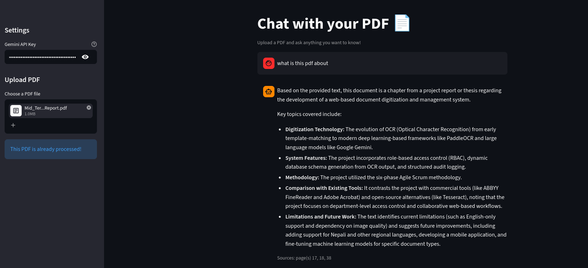

# PDF Chatbot — AI Powered RAG Assistant


<p align="center">
  <b>A beautiful AI-powered PDF Q&A app built with Streamlit, Gemini, LangChain, and ChromaDB.</b>
</p>

<p align="center">
  
  
  
  
</p>

---

Wanna try it out? -> [Here you go!](https://pdf-qna-chatbott.streamlit.app/)


#  Features

-  Upload and chat with any PDF
-  AI-powered answers using Gemini
-  RAG (Retrieval-Augmented Generation) pipeline
-  Persistent vector database using ChromaDB
-  Chat history saving
-  Streaming responses like ChatGPT
-  Source page citations
-  Beautiful and responsive Streamlit UI
-  Smart contextual conversations

---

# Tech Stack

| Technology                     | Purpose           |
| ------------------------------ | ----------------- |
| Streamlit                      | Frontend UI       |
| Gemini API                     | LLM + Embeddings  |
| LangChain                      | RAG orchestration |
| ChromaDB                       | Vector storage    |
| PyPDFLoader                    | PDF parsing       |
| RecursiveCharacterTextSplitter | Chunking          |

---


#  UI Preview


---


#  How It Works

1. User uploads a PDF
2. PDF is parsed using `PyPDFLoader`
3. Text is split into chunks
4. Chunks are embedded using Gemini embeddings
5. Embeddings are stored in ChromaDB
6. User asks questions
7. Relevant chunks are retrieved
8. Gemini generates answers from retrieved context
9. Sources are shown with page numbers
---

# Installation

##  Clone the repository

```bash
git clone https://github.com/Raksha-Karn/TinyRAG-PDF-Chatbot.git
cd pdf_rag
```

---

##  Create virtual environment

```bash
uv init
```


---

##  Install dependencies

```bash
uv sync
```

---

#  Gemini API Key

Get your API key from:  https://aistudio.google.com/app/apikey

---

#  Run the App

```bash
streamlit run app.py
```
